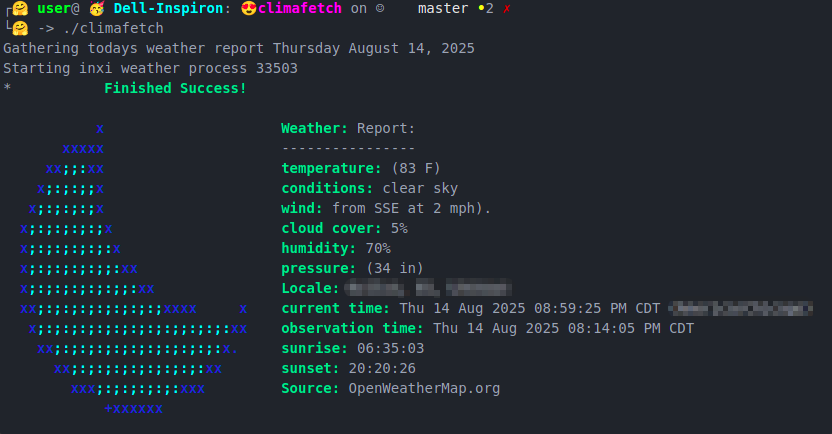

<div align="center">


### Fun Bash Scripts 📃  Climafetch  ⛅

</div>

See the current outdoor climate like [wthrr](https://github.com/ttytm/wthrr-the-weathercrab) or [wego](https://github.com/schachmat/wego) but display it like [neofetch](https://github.com/dylanaraps/neofetch)

Climafetch aims to be an easy to use weather app that retrieves the current weather conditions and display them in a linux bash terminal. While Climafetch is pretty simple to use, please don't hesitate to check documentation for help installing and using it! Currently under development, but a release may be happening soon...

## ✨ Features
<div align="center">




</div>

## 🧩 Install

TODO:  Add instruction how to download release.  !These are just placeholders!

>[!IMPORTANT]
>**Climafetch** is in development and is unstable.  
>**Climafetch** has only been tested on Debian Linux system, but will probably work on other distros.  
>Mac and Windows is currently untested.

>[!NOTE]
>Windows Users!  You need to run a few extra commands first!  After that, you can install.

- Install dependencies (they may already be installed):
  ```sudo apt install inxi wget lolcat```
- Download latest release:
  ```wget https://github.com/AptGetMe/climafetch/releases/climafetch```
- Allow execution permissions:
  ```chmod +x climafetch```
- Move to /usr/local/bin:
  ```sudo mv climafetch /usr/local/bin```

## 🚀 Run

Open a terminal and execute app.
```climafetch```

## 🗑️ Uninstall

Open a terminal and remove script.
```sudo rm /usr/local/bin/climafetch```

## 🛠️ Build Contribute

- Clone Github Repository https://github.com/AptGetMe/climafetch.git
- In VSCode or Pulsar, open the cloned repo folder as a new project
- Test to make sure the environment is working by running script in the intergrated terminal ./climafetch
- Program away!
- Open a new pull request to submit changes!

## ⭐ Support the Project

If you enjoy this app, please star this repository and share it with your friends online! 😊

## 📝 License
This project is licensed under the **MIT License**. 
